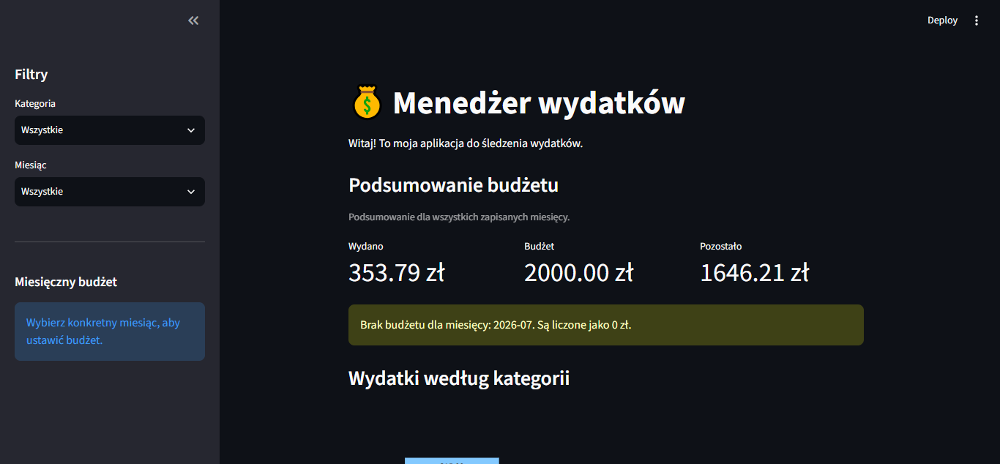
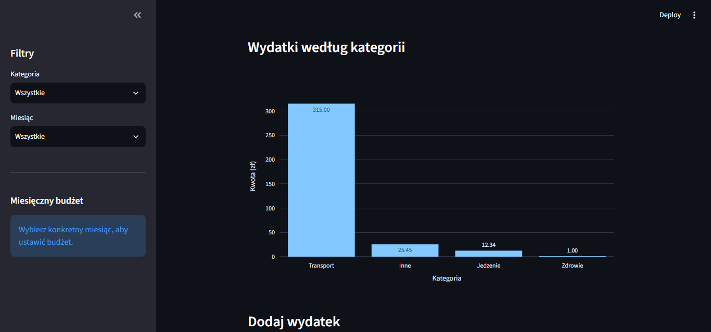
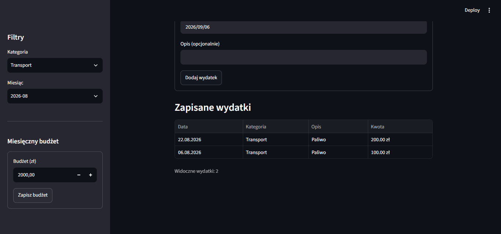

# Menedżer wydatków

Aplikacja webowa do zapisywania wydatków, kontrolowania miesięcznego budżetu i analizowania kosztów według kategorii.

Projekt powstaje jako portfolio i praktyczny powrót do języka Python. Jest rozwijany iteracyjnie, a każdy ukończony sprint otrzymuje osobny tag i GitHub Release.

## Status projektu

Opublikowane wersje obejmują formularz wydatków, trwały zapis SQLite, filtrowanie, miesięczne budżety, podsumowania i wykres Plotly. Sprint 7 z automatycznymi testami oraz materiałami portfolio został opublikowany jako `v0.7.0`.

Przed wydaniem pełnego MVP `v1.0.0` zostaną jeszcze dodane edycja oraz usuwanie wydatków.

## Funkcje

- dodawanie wydatku z kwotą, kategorią, datą i opcjonalnym opisem;
- walidacja kwoty oraz długości opisu;
- trwały zapis danych w lokalnej bazie SQLite;
- filtrowanie tabeli według kategorii i miesiąca;
- ustawianie oraz aktualizowanie miesięcznego budżetu;
- podsumowanie wydatków, budżetu i pozostałej kwoty;
- ostrzeżenia o braku lub przekroczeniu budżetu;
- interaktywny wykres wydatków według kategorii;
- automatyczne testy logiki bazy danych w pytest.

## Zrzuty ekranu

### Podsumowanie budżetu



### Wydatki według kategorii



### Filtrowanie zapisanych wydatków



## Technologie

- Python 3.12+
- Streamlit — interfejs webowy
- SQLite — lokalna baza danych
- Plotly — interaktywny wykres
- pytest — testy automatyczne
- Git i GitHub — historia zmian oraz publikowanie wersji

## Uruchomienie na Windows

Wymagane są Python 3.12 lub nowszy oraz Git.

```powershell
git clone https://github.com/kamiln123/menedzer-wydatkow.git
cd menedzer-wydatkow
py -m venv .venv
.\.venv\Scripts\python.exe -m pip install -r requirements.txt
.\.venv\Scripts\python.exe -m streamlit run app.py
```

Po uruchomieniu aplikacja będzie dostępna w przeglądarce, zwykle pod adresem `http://localhost:8501`.

Baza `data/expenses.db` jest tworzona automatycznie. Folder z lokalnymi danymi jest ignorowany przez Git i nie trafia do repozytorium.

## Testy

```powershell
.\.venv\Scripts\python.exe -m pytest -v
```

Testy korzystają z oddzielnej, tymczasowej bazy SQLite. Nie odczytują ani nie zmieniają danych zapisanych przez aplikację.

## Struktura projektu

```text
app.py                  interfejs aplikacji Streamlit
database.py             operacje na bazie SQLite
tests/test_database.py  automatyczne testy bazy danych
docs/                   dokumentacja sprintów i decyzji
requirements.txt        zależności środowiska Python
```

## Dokumentacja

- [Plan projektu](docs/plan-projektu.md)
- [Dziennik decyzji](docs/decyzje.md)
- [Sprinty i wersje](docs/sprinty-i-wersje.md)

## Dalszy plan

- `v0.7.0` — automatyczne testy i materiały portfolio — opublikowano;
- `v0.8.0` — edycja i usuwanie wydatków;
- `v1.0.0` — końcowy przegląd i kompletne MVP.
