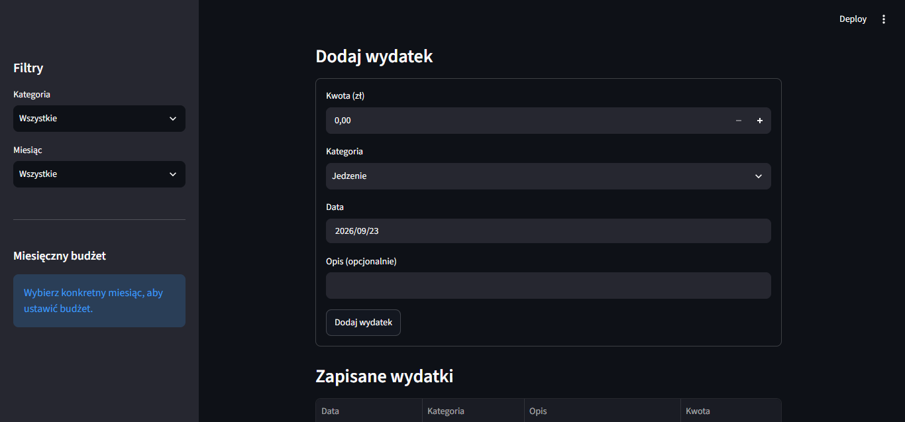
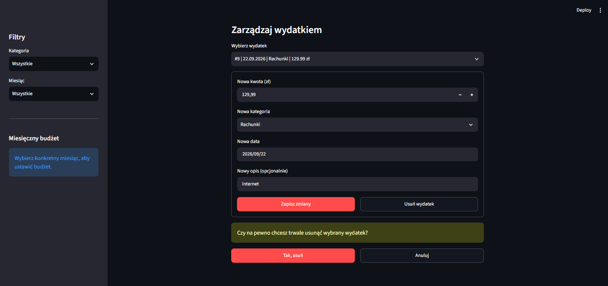

# Menedżer wydatków

[](https://github.com/kamiln123/menedzer-wydatkow/actions/workflows/tests.yml)

Aplikacja webowa do zapisywania wydatków, kontrolowania miesięcznego budżetu i analizowania kosztów według kategorii.

Projekt powstał jako portfolio i praktyczny powrót do języka Python. Był rozwijany iteracyjnie, a każdy ukończony sprint otrzymał osobny tag i GitHub Release.

## Status projektu

Kompletne MVP zostało opublikowane jako [`v1.0.0`](https://github.com/kamiln123/menedzer-wydatkow/releases/tag/v1.0.0). Aplikacja obejmuje formularz wydatków, trwały zapis SQLite, filtrowanie, miesięczne budżety, podsumowania, wykres Plotly, edycję i bezpieczne usuwanie oraz automatyczne testy lokalne i w GitHub Actions.

## Funkcje

- dodawanie wydatku z kwotą, kategorią, datą i opcjonalnym opisem;
- edytowanie istniejących wydatków bez tworzenia duplikatów;
- usuwanie wydatków z dodatkowym potwierdzeniem;
- walidacja kwoty oraz długości opisu;
- trwały zapis danych w lokalnej bazie SQLite;
- filtrowanie tabeli według kategorii i miesiąca;
- ustawianie oraz aktualizowanie miesięcznego budżetu;
- podsumowanie wydatków, budżetu i pozostałej kwoty;
- ostrzeżenia o braku lub przekroczeniu budżetu;
- interaktywny wykres wydatków według kategorii;
- automatyczne testy logiki bazy danych w pytest.

## Zrzuty ekranu

### Podsumowanie budżetu


### Wydatki według kategorii


### Dodawanie wydatku



### Filtrowanie zapisanych wydatków


### Edycja i bezpieczne usuwanie



## Technologie

- Python 3.13
- Streamlit — interfejs webowy
- SQLite — lokalna baza danych
- Plotly — interaktywny wykres
- pytest — testy automatyczne
- Git i GitHub — historia zmian oraz publikowanie wersji

## Architektura

- `app.py` odpowiada za interfejs Streamlit, walidację formularzy i prezentację danych;
- `database.py` oddziela operacje SQLite od interfejsu i korzysta z parametryzowanych zapytań SQL;
- kwoty są przechowywane jako całkowita liczba groszy, aby uniknąć błędów liczb zmiennoprzecinkowych;
- `tests/test_database.py` sprawdza logikę na oddzielnych, tymczasowych bazach;
- GitHub Actions instaluje zależności i uruchamia testy po zmianach w `main` oraz w pull requestach.

## Jakość projektu

- 7 odizolowanych testów automatycznych;
- automatyczna weryfikacja CI na GitHubie;
- ograniczenia i walidacja danych w interfejsie oraz schemacie SQLite;
- lokalna baza i sekrety wykluczone z repozytorium;
- kolejne etapy projektu zapisane jako tagi i GitHub Releases.

## Uruchomienie na Windows

Wymagane są Python 3.13 oraz Git.

```powershell
git clone https://github.com/kamiln123/menedzer-wydatkow.git
cd menedzer-wydatkow
py -m venv .venv
.\.venv\Scripts\python.exe -m pip install -r requirements.txt
.\.venv\Scripts\python.exe -m streamlit run app.py
```

Po uruchomieniu aplikacja będzie dostępna w przeglądarce, zwykle pod adresem `http://localhost:8501`.

Baza `data/expenses.db` jest tworzona automatycznie. Folder z lokalnymi danymi jest ignorowany przez Git i nie trafia do repozytorium.

## Testy

```powershell
.\.venv\Scripts\python.exe -m pytest -v
```

Testy korzystają z oddzielnej, tymczasowej bazy SQLite. Nie odczytują ani nie zmieniają danych zapisanych przez aplikację.

## Struktura projektu

```text
app.py                  interfejs aplikacji Streamlit
database.py             operacje na bazie SQLite
tests/test_database.py  automatyczne testy bazy danych
.github/workflows/      automatyczne testy GitHub Actions
docs/                   dokumentacja sprintów i decyzji
requirements.txt        zależności środowiska Python
LICENSE                 licencja MIT
```

## Dokumentacja

- [Plan projektu](docs/plan-projektu.md)
- [Dziennik decyzji](docs/decyzje.md)
- [Sprinty i wersje](docs/sprinty-i-wersje.md)

## Licencja

Projekt jest udostępniany na licencji MIT. Szczegóły znajdują się w pliku [LICENSE](LICENSE).

## Wersje końcowe

- `v0.7.0` — automatyczne testy i materiały portfolio — opublikowano;
- `v0.8.0` — edycja i usuwanie wydatków — opublikowano;
- `v1.0.0` — końcowy przegląd i kompletne MVP — opublikowano.
